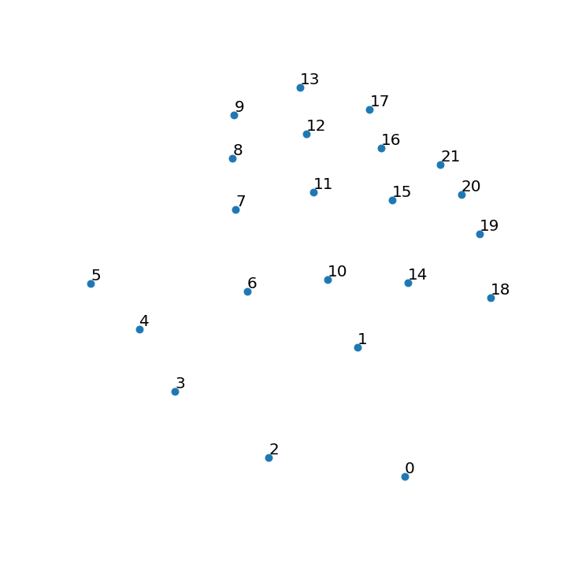

This folder contains min-max scaled 2d matrices of data from two sources - leapmotion and mediapipe hands

Every joint of matrix represents specific point on hand (mostly joints).

matrices saved as np.ndarrays

todo -> explain mpJoints center of hand
