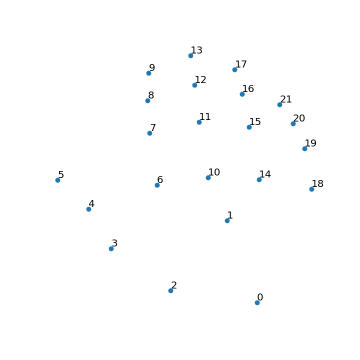

This folder contains all the parsed and collected data during the data collection process.

1. `joints` - numerical data representing positions of joints detected in frame
The folder contains:
- leapJoints - data collected by LeapMotion SDK
- mpJoints - data collected by Mediapipe.Hands library

Every file in these directories is a 2D numpy.ndarray of size (22,3)

array([[X position, Y position, Z position],...])

Every row represents specific point on the hand

Note: Joint with index 1 in `mpJoints` folder was added manually (based on the center of weight the inner hand points. Explained in more detail in joints/readme.md)

2. `photoPadded` - images of hands in .png format
Folder contains

nothing for now, i need to fix the algorithm bcs something went wrong there

3. `photoRaw` - images of hands without any padding
Images from three different sources, as expected
`leapCropped` - camera photos of hands in position
`leapJoints` - images of points representing locations in the hand extracted with LeapMotion SDK
`mpPhotos` - images of points representing locations in the hand extracted with mediapipe.Hands  
